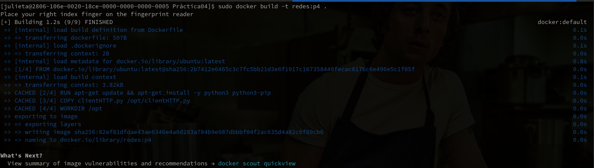
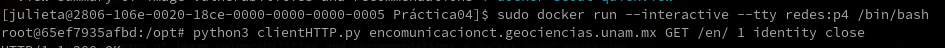
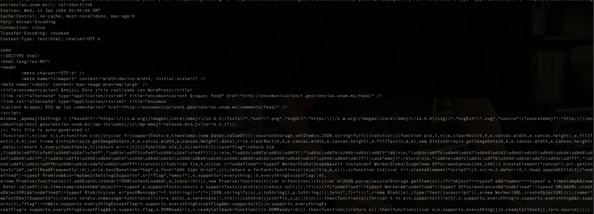
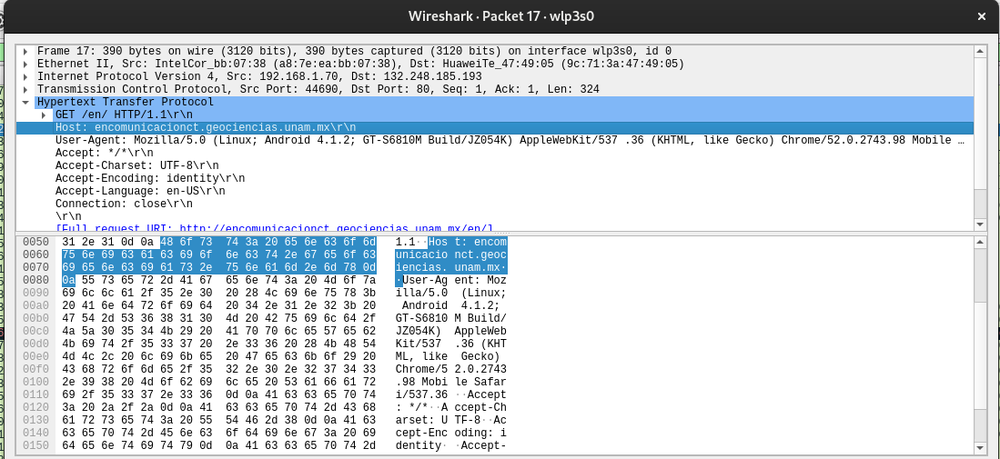
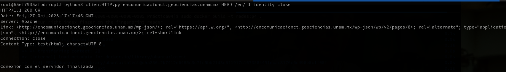
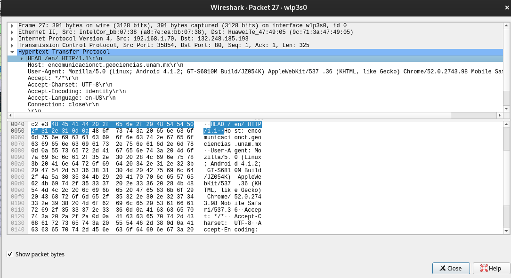

# Universidad Nacional Autónoma de México
## Facultad de Ciencias
### Taller de Sistemas Operativos, Redes de Cómputo, Sistemas Distribuidos y Manejo de Información
#### Práctica IV: Programación de un cliente de HTTP y uso de contenedores.
##### Isaias Castrejón Martinez
##### Julieta Vargas Gutiérrez


---

## Índice

  - [Cliente HTTP](#cliente-http)

    - [Características](#características)

    - [Uso](#uso)

    - [Ejecución con Docker](#ejecución-con-docker)

  - [Ejemplo de ejecución](#ejemplo-de-ejecución)
  
    - [Método GET](#método-get)

    - [Método HEAD](#método-head)

  - [Preguntas](#preguntas) 
---
## Cliente HTTP

Este es un cliente HTTP simple escrito en Python 3, diseñado como parte de una práctica para el curso de Redes.

## Características

- Realiza solicitudes HTTP a servidores web utilizando el protocolo HTTP/1.1.
- Admite los métodos HTTP `GET` y `HEAD`.
- Permite configurar diferentes encabezados, como `User-Agent`, `Accept-Encoding` y `Connection`.

## Uso

Para usar el cliente HTTP fuera de Docker:

```bash
python3 clientHTTP.py [host] [http_method] [url] [user_agent] [encoding] [connection]
```

Ejemplo:

```bash
python3 clientHTTP.py www.fciencias.unam.mx GET / 1 identity close
```

## Ejecución con Docker

### Construcción de la imagen Docker:

```bash
sudo docker build -t redes:p4 .
```

### Ejecución del contenedor:

```bash
sudo docker run --interactive --tty redes:p4 /bin/bash
```

Dentro del contenedor, ejecute el cliente con:

```bash
python3 clientHTTP.py [tus argumentos aquí]
```

Ejemplo 

```bash
python3 clientHTTP.py encomunicacionct.geociencias.unam.mx GET /en/ 1 identity close
```

## Ejemplo de ejecución

### Método GET

Haremos este ejemplo usando docker

  1. Primero buscamos la `url` a la que queremos acceder, en este caso escogimos 
  [En comunicación ct](http://encomunicacionct.geociencias.unam.mx/en/)

  

  2. Construimos la imagen

  

  3. Ejecutamos tanto contenedor como el cliente

  

  4. Podemos ver la respuesta del cliente 

  

  5. Capturamos el tráfico en Wireshark 

  

### Método HEAD

  1. Ejecutamos el comando `python3 clientHTTP.py encomunicacionct.geociencias.unam.mx HEAD /en/ 1 identity close`

  

  2. Vemos el tráfico en Wireshark

  

## Preguntas

### ¿Cuál es la función de los métodos de HTTP HEAD, GET, POST, PUT y DELETE?

- **HEAD**: 
  - Solicita únicamente los encabezados de la respuesta para ver características del recurso, sin retornar el cuerpo de la respuesta.
  
- **GET**: 
  - Solicita una representación del recurso especificado. GET debe ser utilizado solo para recuperar datos.
  
- **POST**: 
  - Se utiliza para enviar una entidad a un recurso en específico, causando a menudo un cambio en el estado o efectos secundarios en el servidor.
  
- **PUT**: 
  - Reemplaza todas las representaciones actuales del recurso de destino con la carga útil de la petición.
  
- **DELETE**: 
  - Solicita que un recurso sea removido.

## Categorías de códigos de estado de HTTP

- **1xx (Respuestas Informativas)**: Indica que la petición fue recibida y se encuentra en proceso.
- **2xx (Respuestas Exitosas)**: Indica que la petición fue recibida, comprendida, y aceptada exitosamente.
- **3xx (Redirecciones)**: Indica que se necesitan acciones adicionales para completar la petición, generalmente en cuanto a redirección.
- **4xx (Errores del Cliente)**: Indica que hubo un error en la petición del cliente, como petición mal formada, petición no autorizada, recurso no encontrado, etc.
- **5xx (Errores del Servidor)**: Indica que el servidor falló en completar una petición válida.

## Campos `encoding` y `connection`

- **encoding**:
  - Especifica el método de codificación que se aplicará a los datos antes de transmitirlos. Por ejemplo, "gzip" indica que los datos se comprimirán usando el algoritmo GZIP.
  
- **connection**: 
  - Especifica opciones de control para la conexión actual. Por ejemplo, "keep-alive" indica que la conexión debe mantenerse abierta para futuras peticiones, mientras que "close" indica que la conexión debe cerrarse después de completar la respuesta.

